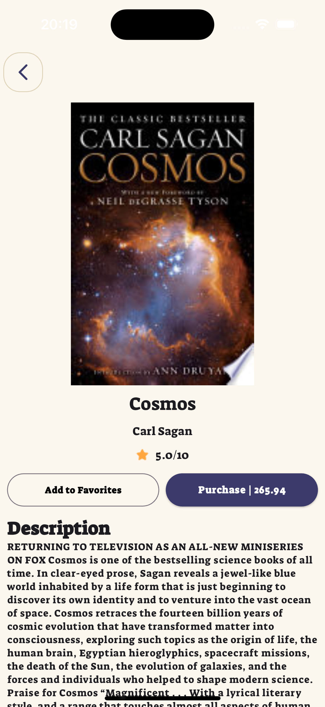

# Book Element

Books Element is a versatile mobile application crafted with Flutter. It leverages various cutting-edge technologies to offer users a seamless experience in managing their personal library.

## Features

Features 
- User Authentication: Users can log in using their email address or Google account. 
- Google APIs - Integration: Enables users to utilize Google APIs to save their favorite books directly to Firebase. 
- Library Creation: Users have the ability to create and manage their own library within the application.

## Built With

- [Flutter](https://flutter.dev/)
- [Dart](https://dart.dev/)

## Preview

    
    
    
    
    

## Packages

- State Management
  - [Cubit](https://pub.dev/packages/flutter_bloc)
- Routing
  - [AutoRoute](https://pub.dev/packages/auto_route)
- Dependency Injection
  - [GetIt](https://pub.dev/packages/get_it)
- Code Generation
  - [Freezed](https://pub.dev/packages/freezed)
  - [JsonSerializable](https://pub.dev/packages/json_serializable)
- Authentication
  - [Firebase Auth](https://pub.dev/packages/firebase_auth)
  - [Google Sign In](https://pub.dev/packages/google_sign_in)
- Database
    - [Firebase Firestore](https://pub.dev/packages/cloud_firestore)
- Linter
  - [Very Good Analysis](https://pub.dev/packages/very_good_analysis)
- Network
  - [Dio](https://pub.dev/packages/dio)
- Localizations
 - [Easy Localization](https://pub.dev/packages/easy_localization)
  

